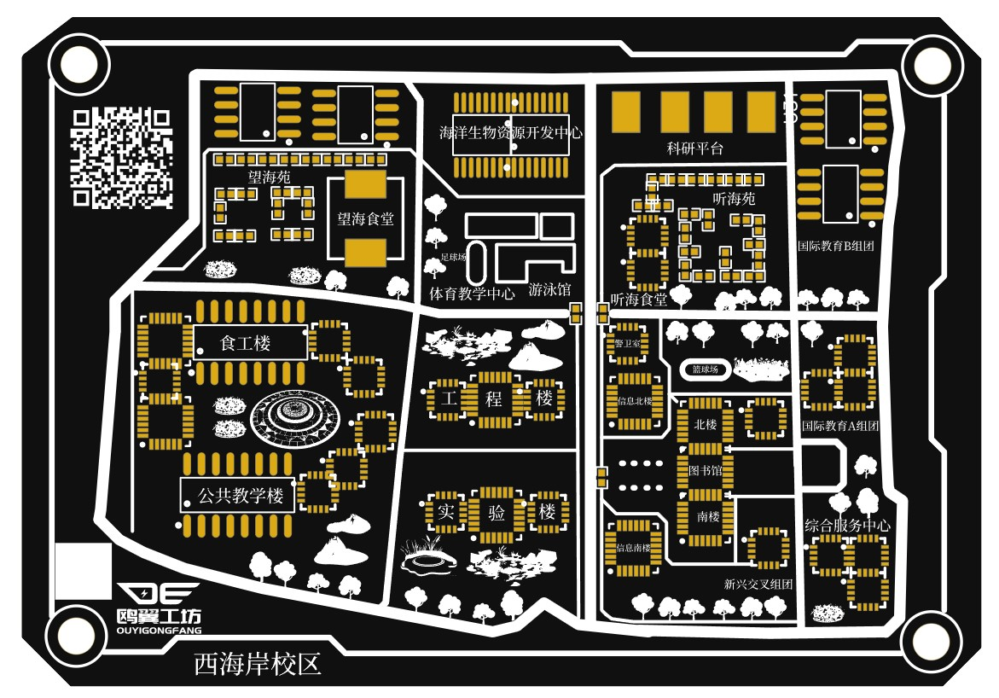
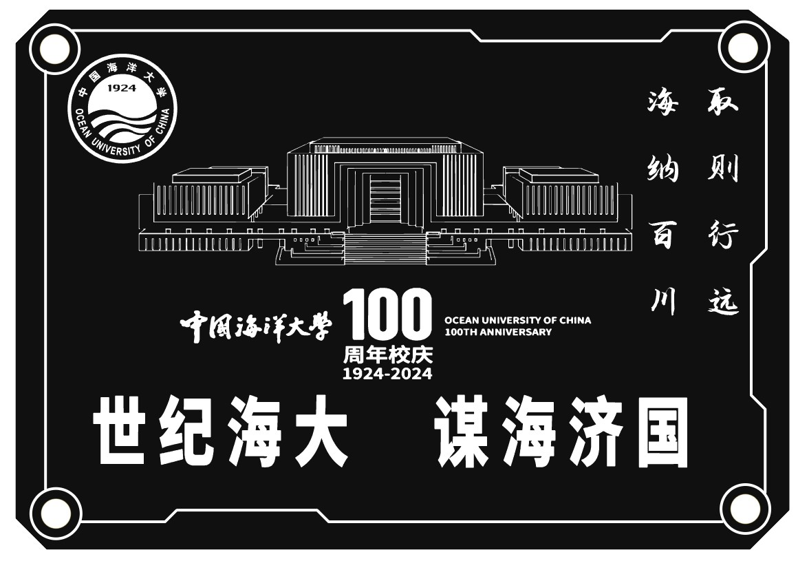

🌬️🌥️

## 说明：
该卡片上所展示的校园建筑与真实情况并不完全相符。

## 如何使用：

打开编辑器，通过：顶部菜单 - 文件 - 打开 - 立创EDA... ，选择 json 文件打开在编辑器，你可以保存文档进工程里面。

## 图片展示:
### 顶层：

### 底层：

## Note:
The campus buildings shown on the card do not exactly match the real situation.

## How to use：

At editor, open the document via: Top menu - File - Open - EasyEDA... , and select the json file, then open it at the editor, you can save it into a project.

